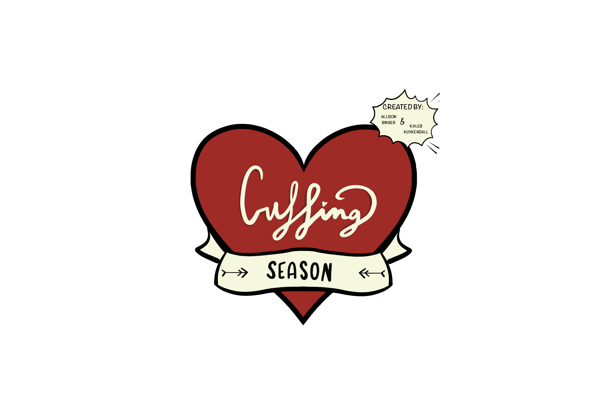

# Cuffing Season - The Game
#### Created by Allison Binger and Kaleb Kuykendall

## Intro/Description
Cuffing Season is about a little snowperson, Frostee, who *magically* comes alive, but learns a heat wave is coming! They want to spend their final days with someone who will enjoy winter to its fullest! Play along and learn about the different people they talk to, and find the right person for Frostee to melt with.

&nbsp;
&nbsp;

## Engine
Cuffing Season uses the game engine 'Godot', which worked best for implementing graphics as well as storing global variables for the player to choose and interact with the best. 

> Godot is a versatile and open-source game development engine that operates at a > low level through its custom scripting language, GDScript. At the core, Godot > employs a scene system where game objects and entities are organized hierarchically within a scene tree. Scenes consist of nodes that represent various elements such as sprites, characters, and cameras. GDScript, specifically designed for game development within Godot, provides an intuitive and Python-like syntax, making it accessible to both beginners and experienced developers. The engine employs a unique scene instancing approach, optimizing memory usage by reusing node structures across scenes. Godot supports a wide range of platforms, from desktop to mobile and web, and features a robust physics engine, visual shader editor, and powerful animation tools. Its node-based architecture allows for modular and extensible game design, facilitating collaborative development and rapid iteration.

We personally chose Godot, after much consideration, because we wanted to include many elements inside of the game, such as graphics, animation, custom scenes, object manipulation, and more. 

&nbsp;
&nbsp;

## Usage:

The game is not currently uploaded to itch.io due to technical issues, although the quality may not be ideal. For best results, clone this repo and store it to your local machine, then load the files into Godot to play the full scene. 

#### Playtime: ~ 5 min
#### Gameplay: [Youtube](https://youtu.be/WkAyvkt7eP0)
***
